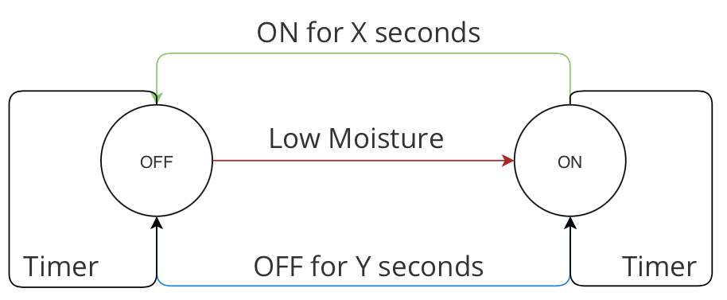

## What

The ``water.ino`` program serves as an auto-irrigation control system, running on Arduino. 

Hardware-wise, it works with a moisture sensor and a water pump. 

Software-wise, it implements the following finite state machine (FSM) to turn on/off the water pump, based on moisture readings.

&nbsp;

### State Transitions

Green line: This transition is to help save water - the pump will run at most X seconds each time. 

Red line: Self-explanatory. I added another condition here so that it will run at most once per Z seconds (to save water).

Blue line: This transition ensures that the pump runs at least once every Y seconds.

Currently, I am using the following configurations:

- X = 5: the pump will run at most 5 seconds each time.

- Z = 24 hours: the pump will run at most once per day.

- Y = 48 hours: trigger the pump if it hasn't been run for 2 days.

&nbsp;

### Sensor Readings

Sensor readings can fluctuate significantly especially during irrigation.

This program reads moisture data from the sensor once per second.

It keeps track of sensor readings for one minute (60 data points).

The average reading is compared against a pre-configured threshold when their standard deviation is below 10.